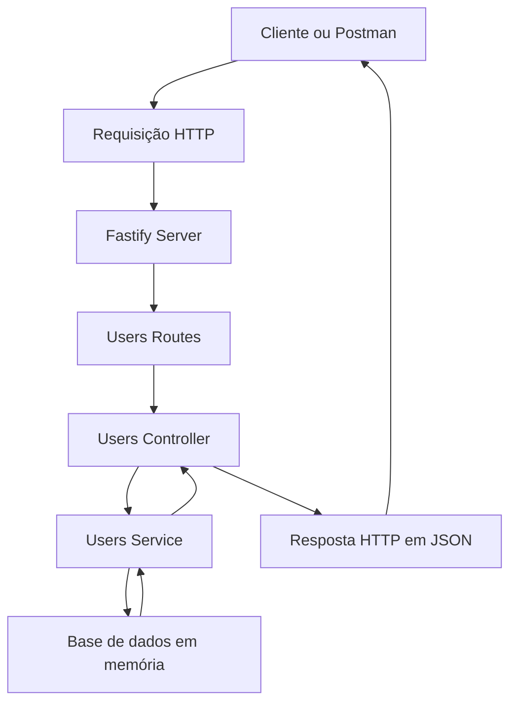
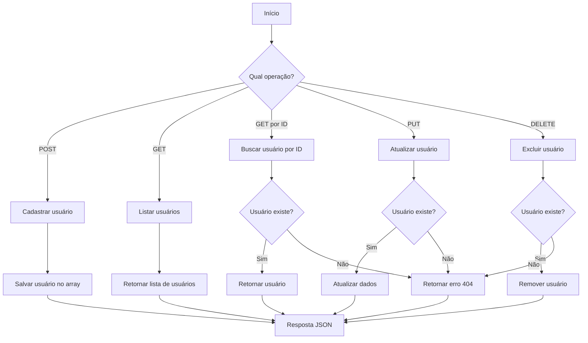

# API Fastify CRUD

API REST desenvolvida com **Node.js** e **Fastify** para realizar operações CRUD de usuários.

O projeto foi criado com foco em aprendizado de desenvolvimento Back-End, organização em camadas, criação de rotas, manipulação de dados em memória e testes de endpoints utilizando o Postman.

---

## Sobre o projeto

A API permite:

- Cadastrar usuários
- Listar todos os usuários
- Buscar um usuário pelo ID
- Atualizar um usuário
- Excluir um usuário

Os dados são armazenados temporariamente em um array na memória. Por isso, os usuários cadastrados são apagados quando o servidor é reiniciado.

---

## Tecnologias utilizadas

- Node.js
- Fastify
- JavaScript
- Nodemon
- Postman
- Git
- GitHub

---

## Estrutura do projeto

```text
api-fastify-crud/
│
├── src/
│   ├── server.js
│   │
│   ├── routes/
│   │   └── users.routes.js
│   │
│   ├── controllers/
│   │   └── users.controller.js
│   │
│   ├── services/
│   │   └── users.service.js
│   │
│   └── database/
│       └── users.js
│
├── .gitignore
├── package.json
├── package-lock.json
└── README.md
```

---

## Arquitetura

O projeto foi organizado em camadas:

### Routes

Responsável por definir os endpoints da API e direcionar as requisições para os controllers.

### Controllers

Recebe as requisições HTTP, chama os services e devolve as respostas para o cliente.

### Services

Contém as regras de negócio e realiza as operações de criação, busca, atualização e exclusão.

### Database

Armazena temporariamente a lista de usuários em memória.

### Server

Inicializa o Fastify, registra as rotas e inicia o servidor.

---

## Fluxograma da aplicação



---

## Fluxograma do CRUD



---

## Rotas da API

| Método | Endpoint | Descrição |
|---|---|---|
| GET | `/` | Verifica se a API está funcionando |
| GET | `/users` | Lista todos os usuários |
| GET | `/users/:id` | Busca um usuário pelo ID |
| POST | `/users` | Cadastra um novo usuário |
| PUT | `/users/:id` | Atualiza um usuário |
| DELETE | `/users/:id` | Exclui um usuário |

---

## Como executar o projeto

### 1. Clone o repositório

```bash
git clone https://github.com/Ronaldo94-GITHUB/api_fastify_crud.git
```

### 2. Entre na pasta

```bash
cd api_fastify_crud
```

### 3. Instale as dependências

```bash
npm install
```

### 4. Inicie o servidor

```bash
npm run dev
```

O servidor ficará disponível em:

```text
http://localhost:3000
```

---

## Exemplos de uso

### Cadastrar usuário

```http
POST /users
```

Body JSON:

```json
{
  "name": "Ronaldo Augusto",
  "email": "ronaldosabino94@gmail.com"
}
```

Resposta esperada:

```json
{
  "id": 1,
  "name": "Ronaldo Augusto",
  "email": "ronaldosabino94@gmail.com"
}
```

Status:

```text
201 Created
```

---

### Listar usuários

```http
GET /users
```

Resposta esperada:

```json
[
  {
    "id": 1,
    "name": "Ronaldo Augusto",
    "email": "ronaldosabino94@gmail.com"
  }
]
```

Status:

```text
200 OK
```

---

### Buscar usuário pelo ID

```http
GET /users/1
```

Resposta esperada:

```json
{
  "id": 1,
  "name": "Ronaldo Augusto",
  "email": "ronaldosabino94@gmail.com"
}
```

---

### Atualizar usuário

```http
PUT /users/1
```

Body JSON:

```json
{
  "name": "Ronaldo Sabino",
  "email": "ronaldosabino94@gmail.com"
}
```

---

### Excluir usuário

```http
DELETE /users/1
```

Resposta esperada:

```json
{
  "message": "Usuário deletado com sucesso",
  "user": {
    "id": 1,
    "name": "Ronaldo Sabino",
    "email": "ronaldosabino94@gmail.com"
  }
}
```

---

## Códigos HTTP utilizados

| Código | Significado |
|---|---|
| 200 | Requisição realizada com sucesso |
| 201 | Usuário criado com sucesso |
| 404 | Usuário ou rota não encontrado |
| 500 | Erro interno do servidor |

---

## Testes

As rotas foram testadas utilizando o Postman.

Foram realizados testes de:

- Cadastro de usuários
- Listagem de usuários
- Busca por ID
- Atualização de dados
- Exclusão de usuários
- Tratamento de usuário não encontrado

---

## Possíveis melhorias

- Adicionar validação de dados
- Utilizar Zod
- Adicionar banco de dados PostgreSQL
- Utilizar Prisma ORM
- Criar autenticação com JWT
- Adicionar Swagger
- Criar testes automatizados
- Utilizar Docker
- Fazer deploy da API

---

## Autor

**Ronaldo Augusto Sabino**

Projeto desenvolvido como prática de Back-End com Node.js e Fastify.
